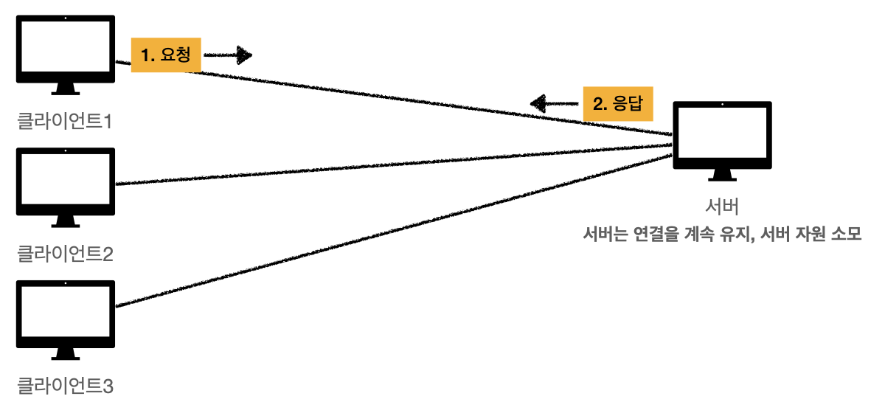
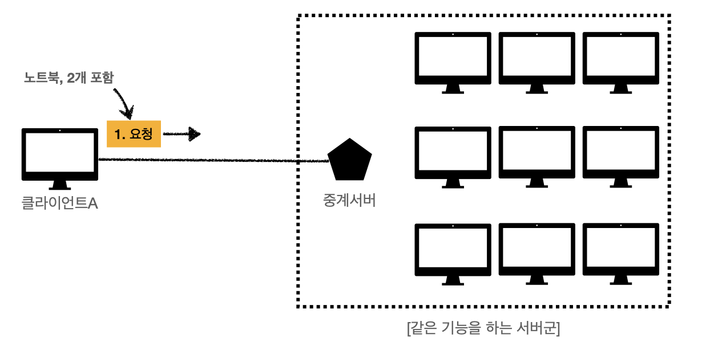

# stateless 특성을 갖는 Http

## 1. stateless 프로토콜의 특성
   상태를 계속  유지하지 않는다.
   즉 Http 프로토콜은 이전에 보냈던 요청이나 응답에 대해서 전혀 기억하지 않는다.

## 2. stateless로 설계된 이유:
많은 데이터를 빠르고 확실하게 처리하는 범위성을 확보하기 위해

### 상태를 유지한다면 ?
1. 상태를 유지하기 위해 클라이언트는 항상 같은 서버와 연결을 유지해야한다. 이 과정에서 서버는 자원을 소모하게 된다. -> 연결을 유지하는 것 자체가 자원 소모
2. 클라이언트가 하나의 서버와만 연결을 유지해야하므로 서버에서 에러가 생기면 문제가 생기게 된다.

### 상태를 유지하지 않는다면 ?
1. 서버는 자원을 최소한으로 소모하게 된다.
2. 클라이언트에 상태가 필요없으므로 통신 과정에서 여러 서버와 통신가능하다.
이를 통해 하나의 서버에서 문제가 생겨도 문제 없이 다른 서버와 통신할 수 있다.

## stateless의 한계
stateless의 특성으로 모든 것을 처리할 수 없다.
상태 유지가 필요한 때가 있다. 
예를 들어 홈페이지에 로그인했을 때, 다른 페이지를 이동하더라도 로그인 상태를 유지해야한다.
Http 프로토콜은 상태를 유지하지 않으므로 Http 프로토콜만으로는 처리할 수 없다.
