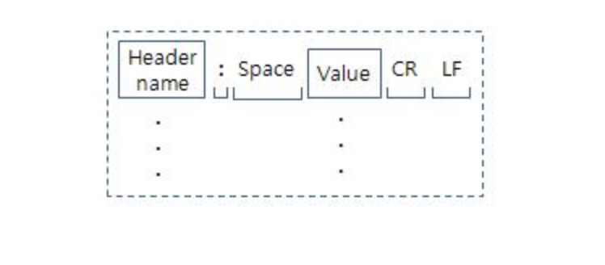

## Http Header

`어떤 프로토콜을 이해하려면 프로토콜의 헤더만 이해하면 된다.` 

Http 메시지에는 메시지 헤더와 메시지 바디가 존재한다.

Http 메시지에는 메시지 헤더가 반드시 존재해야한다.

### Http 헤더 필드는 중요한 정보를 전달한다!

메시지 헤더에는 클라이언트나 서버가 request나 response를 처리하기 위한 정보가 들어있다.

## Http 헤더 필드의 구조 

`헤더 필드 명 : 필드 값`

## Http 헤더의 구성 요소

Http 요청 헤더는 일련의 요청 헤더 행으로 구성되며 하나의 요청 메세지가 복수의 헤더를 가질 수 있다.
HTTP 응답 헤더도 일련의 응답 헤더 행으로 구성되며 하나의 응답 메세지가 복수의 헤더를 가질 수 있다.

