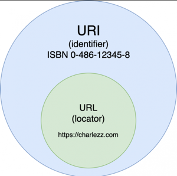
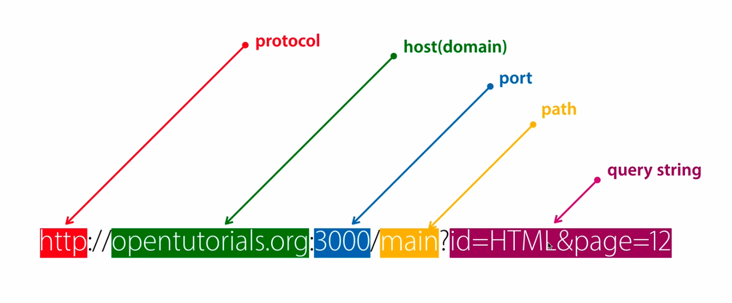

# URI와 URL

URI와 URL을 혼용해서 사용하는 경우가 있는데, 이를 명확하게 구분하기 위해 작성했다.

## URI
- URI란 Uniform Resource Identifier의 약자로 웹 기술에서 사용하는 논리적 또는 물리적 리소스를 식별하는 고유한 문자열 시퀀스이다.
- 통합 자원 식별자로 인터넷에 있는 자원을 나타내는 유일한 주소이다.

### 일반적인 URI의 구조
```scheme:[//[user[:password]@]host[:port]][/path][?query][#fragment]```
- scheme : 사용할 프로토콜을 의미 (ex. 웹에서는 http 또는 https)
- user와 password : (서버에 있는) 데이터에 접근하기 위한 사용자의 이름과 비밀번호
- host와 port : 접근할 대상(서버)의 호스트명과 포트번호
- path : 접근할 대상(서버)의 경로에 대한 상세 정보
- query : 접근할 대상에 전달하는 추가적인 정보 (파라미터)
- fragment : 메인 리소스 내에 존재하는 서브 리소스에 접근할 때 이를 식별하기 위한 정보

## URL
- URL이란 Uniform Resource Locator로 리소스의 장소를 나타낸다.
- 흔히 웹 주소라고 부르며 네트워크 상에서 resource가 어디 있는지 알려주기 위한 규약이다.

두 규약을 한 눈에 보면 다음과 같다.

두 규약의 차이점은 **URI는 식별하고, URL은 위치를 가르킨다.**

## 실세계의 URI와 URL
실세계에 빗대어보면 다음과 같다.  
**"Sun"** 이라는 닉네임은 식별 가능한 오브젝트인 **식별자(identifier)** 이므로 URI와 비슷하다.  
**"서울 강남구 테헤란로 411 성담빌딩 13층"** 은 특정 위치를 가르키는 주소로 URL과 비슷하다. 이때, URL은 URI의 서브셋이므로 URI, URL 둘 다에 해당된다.  

## 네트워크 상의 URI와 URL
흔히 인터넷 환경에서 자원일 식별하기 위해 사용하는 방법에는 Path Variable과 Query Parameter가 있다.
> Path Variable
> - /user/1
> - /user/2
> - ...

> Query Parameter
> - /user?name=sun
> - /user?name=sun&age=10
> - ...


해당 그림을 통해 URI와 URL을 식별할 수 있다.
> http://opentutorials.org:3000/main  
> 은 URL이자 URI로 특정 주소를 가리킨다.

> http://opentutorials.org:3000/main?id=HTML&page=12  
> 는 URI로 자원의 위치가 아닌 자원을 식별하기 위한 식별자이다. `id=HTML&page=12`의 부분은 위치가 아닌 id값이 HTML인 12번 page를 식별하기 위해 사용되었다.

## 퀴즈
1. ```https://example.com```
2. ```https://example.com/somewhere```
3. ```https://example.com/one/two/index```
4. ```https://example.com/one/two/index.html```
5. ```https://example.com/somewhere/123```
6. ```https://example.com/some?id=123&title=something```

