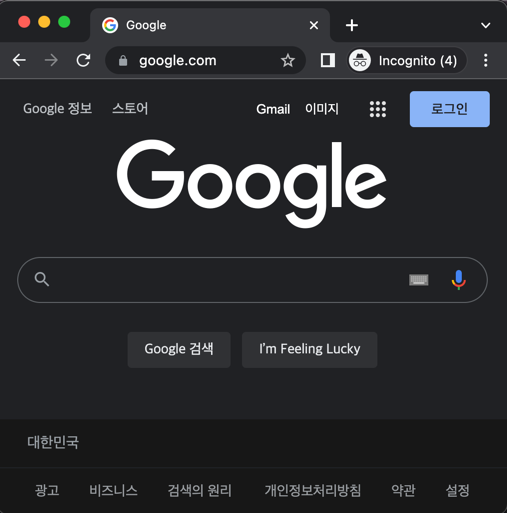
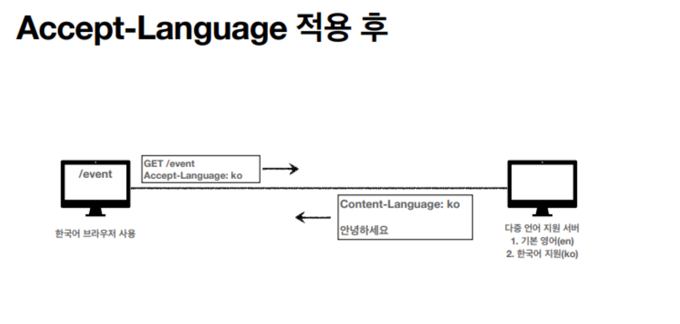
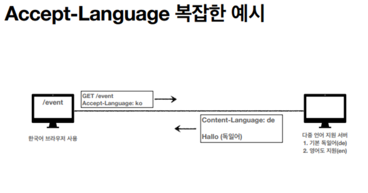
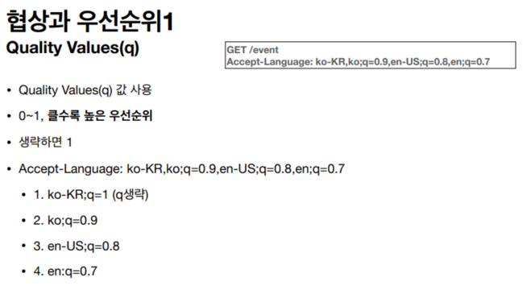
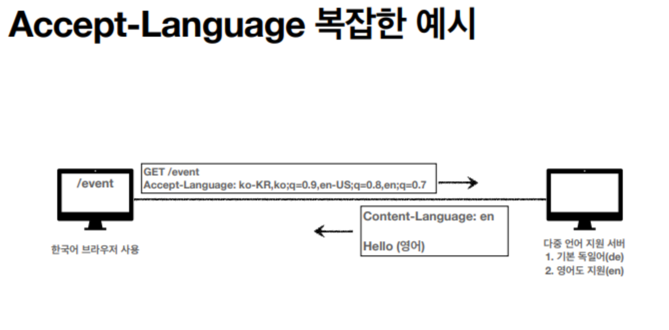
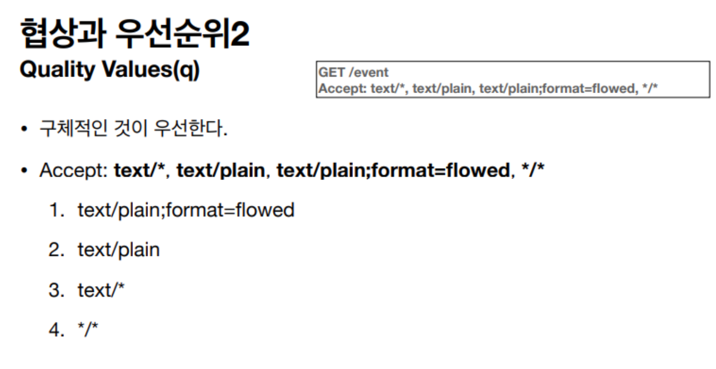
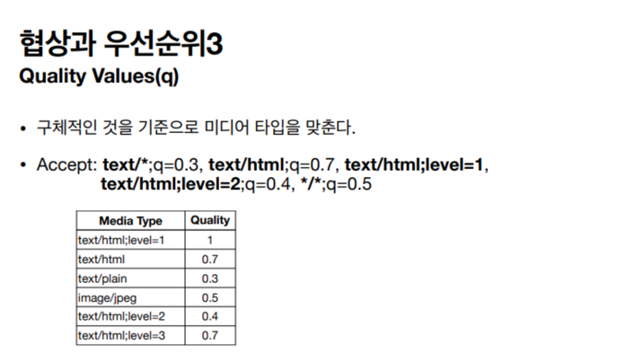

# 콘텐츠 네고시에이션 (Content Negotiation)

`https://www.google.com`  
분명 구글에 접속했는데 어떻게 한글이 나오지? 🤔 해킹 당했나...?  
라고 생각할 수 있겠지만, 이는 `콘텐츠 네고시에이션(Content Negotiation)` 때문이다.

## 콘텐츠 네고시에이션이란?
같은 콘텐츠(내용)이지만 여러 개의 페이지를 지닌 웹페이지가 있다. 방금 전과 같은 상황 (내용은 같지만 영어판/한국어판)처럼 표시되는 언어가 서로 다른 웹페이지의 경우이다.

이러한 웹페이지에서 영어와 한국어와 같이 서로 다른 언어를 주로 사용하는 브라우저가 같은 URI에 액세스할 때에 각각 영어판 웹 페이지와 한국어판 웹 페이지를 표시한다. 이와 같은 구조를 `콘텐츠 네고시에이션`이라 부른다.

콘텐츠(Content) - 내용  
네고시에이션(Negotiation) - 협상  

즉, 클라이언트와 서버가 제공하는 리소스의 내용에 대해 교섭한다는 뜻이며, 클라이언트에 더욱 적합한 리소스를 제공하기 위한 구조이다.

## 판단 기준
다음은 판단할 때의 기준이자 클라이언트가 선호하는 표현 요청의 종류이다.  
- Accept - 클라이언트가 선호하는 `미디어 타입` 전달
- Accept-Charset - 클라이언트가 선호하는 `문자` 인코딩
- Accept-Encoding - 클라이언트가 선호하는 `압축` 인코딩
- Accept-Language - 클라이언트가 선호하는 `자연 언어`
- Content-Language - 서버가 보낸 응답

  
한국어 브라우저를 사용하고 있음에도 외국에 있는 사이트를 접속하면 서버는 영어로 응답한다.  

  
한국어 브라우저를 사용하고 있으며 네고시에이션이 적용되어 한국어로 응답한다.  

  

 

정답
 

기본(default)이 독일어로 설정되어 있기 때문에 독일어로 응답한다.
### 만약 영어로 응답받고 싶다면?
  
우선순위를 설정해서 첫번째 지원하는 언어가 없다면 두 번째 지원하는 언어로 응답을 준다.

  

## 네고시에이션 종류

### 서버 구동형 네고시에이션(Server-driven Negotiation)
서버 측에서 콘텐츠 네고시에이션을 하는 방식이다. 서버 측에서 리퀘스트 헤더 필드의 정보를 참고해서 자동적으로 처리한다. 다만, 브라우저가 보내는 정보를 근거로 하기 때문에 유저에게 정말 적절한 것이 선택되었다고 할 수는 없다.

단점:
- 확장에 용이하지 않다.
  - 기능당 하나의 헤더가 필요한데, 스크린 크기나 해상도 등을 변경하려면 또다른 HTTP 헤더가 필요하다.

### 에이전트 구동형 네고시에이션(Agent-driven Negotiation)
클라이언트 측에서 콘텐츠 네고시에이션을 하는 방식이다. 브라우저에 표시된 선택지 중에서 유저가 수동으로 선택한다.  
이외에도 JavaScript 등을 사용해 웹 페이지에서 자동적으로 정해주는 방식이 있다. 예를 들어, OS의 종류나 브라우저의 종류 등에 의해 PC용 또는 스마트폰용의 웹페이지를 자동으로 전환하는 것이 이에 해당한다.  
> ex) 폰에서 https://www.naver.com 로 접속하면?  
> https://m.naver.com 으로 전환

단점:
- HTTP 표준에서는 사용 가능한 리소스 중, 선택할 수 있는 페이지 형식을 지정하지 않아 프로세스를 자동화할 수 없다.
  - 즉, 거의 항상 스크립팅, 특히 JavaScript 리디렉션과 함께 사용되어야 한다.
- 실제 리소스를 위해 요청이 하나 더 필요해 속도 저하를 야기한다.

### 트랜스페어런트 네고시에이션(Transparent Negotiation)
서버 구동형과 에이전트 구동형을 혼합한 것으로 서버와 클라이언트가 각각 콘텐츠 네고시에이션을 하는 방식이다.

## 그래서 요즘 추세는?
실제로 서버 측 협상에서는 고객의 기대에 대해 많은 가정을 해야 하기 때문에 **많은 활용도를 찾을 수 없다.**

클라이언트 컨텍스트나 클라이언트가 어떻게 리소스 표현을 사용할 지에 대해 유추하기란 거의 불가능하다. 또한 서버 기반 협상은 서버 측 코드를 불필요하게 더 복잡하게 한다. 따라서 대부분의 REST API 구현은 에이전트 구동형 네고시에이션에 의존한다. 에이전트 구동형 네고시에이션은 HTTP 요청 헤더 또는 리소스 URI 패턴의 사용에 따라 달라집니다.

## 참고
- https://www.inflearn.com/course/http-%EC%9B%B9-%EB%84%A4%ED%8A%B8%EC%9B%8C%ED%81%AC
- https://restfulapi.net/content-negotiation/
