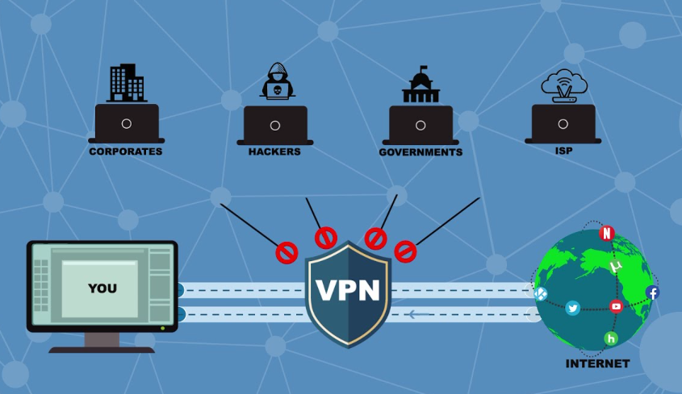
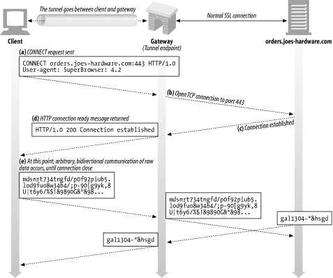

# 터널 (Tunnel)
책에 의하면 터널이란, '서로 떨어진 두 대의 클라이언트와 서버 사이를 중계하며 접속을 주선하는 중계 프로그램'이다.

이렇게 글로 적어 놓으면 의미가 모호해 하나의 예시를 살펴보도록 하겠다.

## VPN (Virtual Private Network)
VPN이란 말 그대로 가상 사설망을 의미한다.  
그래서 그건 또 뭔데? 🤔

 

VPN이란?
 
VPN은 인터넷과 같은 공중망에서 마치 전용회선처럼 사용해 보안성을 향상하면서도 사설망을 이용하지 않았기 때문에 비용 문제까지 해결한 네트워크이다.

> ### 사설망/공중망의 단점
> **사설망(Private Network):**   
> 특정 조직 내에서만 사용되는 네트워크로 인증된 사용자만 사용 가능하며 우수한 보안성을 가지지만 설치 비용이나 관리 비용으 크다.
>
> **공중망(Public Network):**   
> 인터넷처럼 모두에게 공개된 네트워크이기 때문에 보안성이 취약하다.

예를 들면, 배달의민족이 미국 지사까지 진출했는데, 서울 본사와의 중계를 위해 전용선을 구축하려 한다면, 거리에 비례한 막대한 비용이 들게 되고, 이는 현실적으로 불가능하다. 이때, VPN을 사용한다면 비용은 물론 지사의 직원이 본사의 서버와 중요한 데이터를 송수신할 때, 공중망 사용에 의한 **정보 유출 위험에서 멀어진다.** 이는 다음 사진에서 확인할 수 있다.

즉, 공중망을 통해 데이터를 송수신하더라도 정보 유출이 없도록 라우터 체계를 비공개하고, 데이터를 암호화하며, 사용자 인증 기능을 추가하는 등 다양한 방법으로 보안 기능을 제공한다.

위 그림에서 보이는 통로가 바로 VPN을 구성하는 기술 요소 중 하나인 `터널링`이다.

## 터널링
즉 터널링이란, 데이터 스트림을 인터넷 상에서 가상의 파이프를 통해 전달시키는 기술이다. 네트워크에서 터널링 프로토콜을 사용하면 네트워크 사용자는 기본 네트워크가 직접 제공하지 않는 네트워크 서비스에 접근하거나 제공할 수 있다.

### 터널링의 특징
특징은 다음과 같다.
1. 터널 자체는 HTTP 리퀘스트를 해석하려고 하지 않는다. (클라이언트 사이에 통신이 어떤 프로토콜을 사용하던 간에 일단 터널이 구성된다면, 내부의 내용물(Packet)은 캡슐화로 감싸지기 때문에 내용이 더 이상 중요하지 않게 된다.)
2. 특정 프로토콜을 지원하지 않는 네트워크를 통해 외부 프로토콜을 실행할 수 있다.
3. 기본 네트워크 서비스만을 사용하여 제공하기에는 비실용적이거나 안전하지 않은 서비스를 제공할 수 있다. 예를 들면 실제 네트워크 주소가 회사 네트워크의 일부가 아닌 원격 사용자에게 회사 네트워크 주소를 제공 할 수 있다.
4. 터널링은 트래픽 데이터를 다른 형태로 재패키징하기 때문에, 터널을 통해 실행되는 트래픽의 성격이 숨겨진다.

그림을 통해 전체 프로세스를 간략하게 살펴보도록 하겠다.  

### 터널링과 캡슐화의 차이
터널링은 다른 프로토콜의 네트워크 인프라를 사용해 한 프로토콜의 데이터(payload)를 전송하는데 사용하는 방법이다. 캡슐화는 중간 네트워크를 통해 올바르게 전송(터널링) 될 수 있도록 추가 헤더로 프레임을 캡슐화 하는 프로세스이다.

즉, 터널링은 캡슐화, 전송 및 캡슐화 해제의 전체 프로세스를 지칭하는 반면, 캡슐화는 이 전체 프로세스 내의 한 단계이다. (다만, 전체 부분 관계와 상관없이 터널링을 캡슐화라고 부르기도 한다.)

## 참고
- https://www.differencebetween.com/difference-between-encapsulation-and-vs-tunneling/#:~:text=Encapsulation%20and%20Tunneling%3F-,Tunneling%20is%20a%20method%20used%20to%20transfer%20a%20payload%20of,through%20the%20intermediate%20network%20correctly.
- https://brainbackdoor.tistory.com/130
- https://blackrice91.tistory.com/107
- https://liveyourit.tistory.com/3
- https://i.ytimg.com/vi/jtecwQ-x5Og/maxresdefault.jpg
