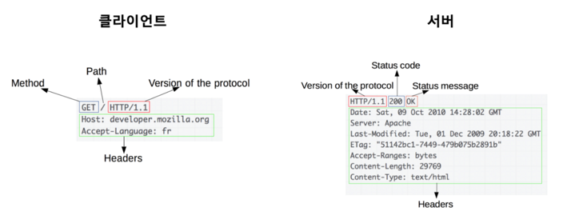
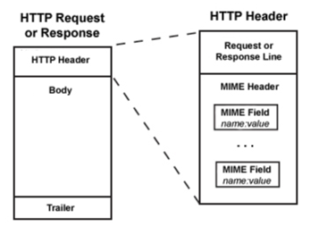
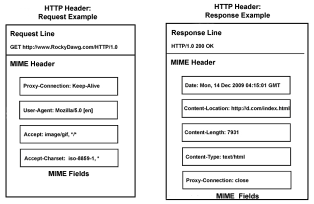
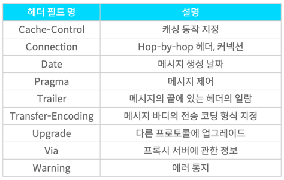

# 6.2.3 4 종류의 HTTP 헤더 필드

HTTP 메시지는 다음과 같이 클라이언트와 서버 사이에서 전송된다.  

HTTP 메시지 구성 요소  

HTTP Header 구성 요소  

## HTTP 헤더 필드란?
HTTP 헤더 필드는 중요한 정보를 전달한다.  
헤더 필드는 HTTP 메시지의 구성 요소 중 하나이다. 클라이언트와 서버간의 통신에서 요청(Request)과 응답(Response)에 사용되며 정보를 전달하는 역할을 한다.

## 헤더 필드 4 종류

### 일반적 헤더 필드(General Header Fields)
요청 및 응답 메시지 둘 다 사용하는 헤더

공통 헤더는 요청 및 응답의 메시지 모두에서 사용되지만 컨텐츠에는 적용되지 않는 헤더이다.  
즉, 전송되는 HTTP 본문과 관련 X  
요청/응답이 생성된 날짜 및 시간 등과 같은 HTTP 통신에 대한 일반 적인 정보
ex) `Date:Tue, 12 May 2022 17:00:00 GMT`  

### 리퀘스트 헤더 필드(Request Header Fields)
요청 헤더는 요청한 URL, 메서드(ex. GET, POST, HEAD), 요청 생성에 사용된 브라우저 및 기타 정보와 같은 요청에 대한 정보가 포함된다.  
ex) `User-Agent:"Mozilla/5.0(Windows NT 10.0)` 등  
브라우저 용어는 User Agent(사용자 에이전트)라고 하는데, 페이지에 대한 간단한 요청도 사용중인 브라우저 및 운영체제에 대한 정보를 전송해야 한다.

### 리스폰스 헤더 필드(Response Header Fields)
위치 또는 서버 자체에 대한 정보(이름, 버전)과 같이 응답에 대한 부가적인 정보를 갖는 헤더이다.

### 엔티티 헤드 필드(Entity Header Fields)
엔티티 헤더에는 실제 메시지 또는 정송중인 HTTP 본문에 대한 정보가 포함된다. 컨텐츠 길이, 컨텐츠 언어, 인코딩, 만료 날짜 및 기타 중요한 정보와 같은 것들을 전달한다.  
ex) Cotents-Length:4959

위에 컨텐츠 길이 4,595 바이트는 헤더를 제외한 본문 길이이며 브라우저는 수신된 데이터를 읽기 시작하고 헤더 섹션에는 CSS, JS, 이미지 파일의 URL에 연결해 별도의 HTTP 요청을 통해 해당 리소스를 가져온다.
