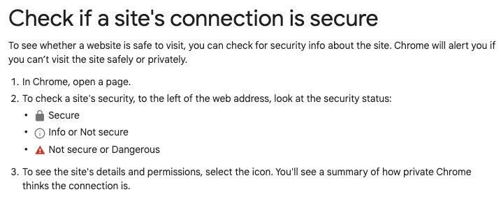
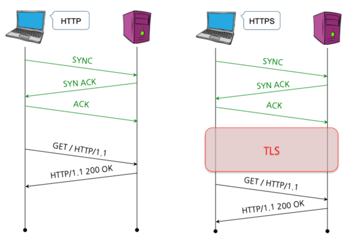

# HTTPS 란?

구글 크롬은 암호화되지 않은 모든 사이트(HTTP)에 대해 '안전하지 않음' 표시를 한다.  
일반적인 웹 사이트들을 보면 `http://`, `https://`와 같이 되어있다. `http`에는 자물쇠가 잠겨있지 않고, `https`에는 자물쇠가 잠겨있는 것을 보아 `https` 더 안전해 보이는데 왜 그러는지 알아보도록 하겠다.

## HTTP의 약점
`Http` 또한 편히라며 장점이 있는 프로토콜이지만, 다음과 같은 단점이 있다.   

1. 평문이기 때문에 도청이 가능하다.
- HTTP를 사용하는 리퀘스트나 리스폰스 통신 내용은 HTTP 자신을 암호화하는 기능은 없다.  
- 즉, 통신 전체가 암호화 되지는 않아 평문으로 HTTP 메시지를 보내게 된다.
- TCP/IP는 도청 가능한 네트워크이기 때문에 암호화를 하지 않고 통신을 하게 되면 중간에 누가 흠쳐볼 수 있다. 
- 만약 로그인/회원가입 같이 비밀번호를 입력하는 중요한 경우에 HTTP 평문으로 통신하면 한다면?
- 누군가 중간에 통신을 도청해서 비밀번호를 그대로 볼 수 있게 된다. 

2. 통신 상대를 확인하지 않기 때문에 위장이 가능하다.
- HTTP를 사용한 리퀘스트나 리스폰스에서는 통신 상대를 확인하지 않는다. 
- 만약, `http://www.woowacourse.com` 이라는 주소가 있다면, A, B, C 라는 사람이 모두 해당 URL로 접속할 수 있는데 이 때 서버 입장에서는 클라이언트가 누군지 확인할 수 없습니다. 
  - 즉, 리퀘스트를 보낸 곳이 신뢰할 수 있는 클라이언트인지, 서버인지를 알 수 없다는 뜻입니다.

3. 완전성을 증명할 수 없기 때문에 변조가 가능하다.
- 완전성이란?  정보의 정확성.
- A라는 웹 사이트에서 파일을 다운 받았는데, 해당 파일이 A 웹 사이트 서버의 파일과 같은 파일인지를 확신할 수가 없다.   
**-> 중간자(Man-in-the-Middle) 공격**
- 통신 도중에 변조될 수 있다는 가능성이 남아있다.
- 통신 중간에 변조가 되었다고 해도 알 수 있는 방법이 없다.

## HTTPS로 가야 하는 이유
1. Identity(인증)

특정 사이트에 접속하려면 브라우저는 해당 사이트의 인증서를 수신하기 때문에 접속한 사이트가 유효한 사이트임을 신뢰할 수 있다.

2. Integrity(무결성)

웹 사이트와 사용자의 브라우저 간의 통신을 침입자가 변조(광고 삽입, 악성코드 설치 등)되는 것을 방지한다.

3. Confidentiality(기밀성)

침입자가 웹 사이트와 사용자의 브라우저간 간의 통신을 감청(사용자의 브라우저 활동 모니터링, identity 노출, 개인 정보 등)할 수 없도록 보호한다.

4. 신기술(새로운 프로토콜 및 브라우저 API)에 대한 대응

새로운 프로토콜 HTTP/2, QUIC에서, 그리고 최신 API 경우 getUserMedia(video, audio), WebRTC, ServiceWorker, Geolocation, Push notification, Progressive Web App 등에서 실행 허가가 필요한데 HTTPS가 실헹 허가에 중요한 요소이다.

5. 기타

Google은 HTTPS 페이지를 우선적으로 색인을 생성  ex) SEO(Search Engine Optimization) 헤택  
(구글의 검색 엔진에서 상위 노출을 위한 조건 중 하나 = https)

## HTTP와 HTTPS

### HTTP
TCP 핸드셰이크 후에 HTTP 요청/응답으로 서로 어플리케이션 데이터를 주고 받는다. 이때 통신은 평문으로 이루어지고, 중간자 HTTP 데이터를 보거나 변조가 가능하다. 

### HTTPS
HTTP over TLS를 말하며, TCP 핸드세이크 후에 TLS 핸드셰이크를 진행하고 그후부터는 암호화 통신이 시작되며 HTTP 요청/응답을 통해 어플리케이션 데이터를 주고 받는다.

