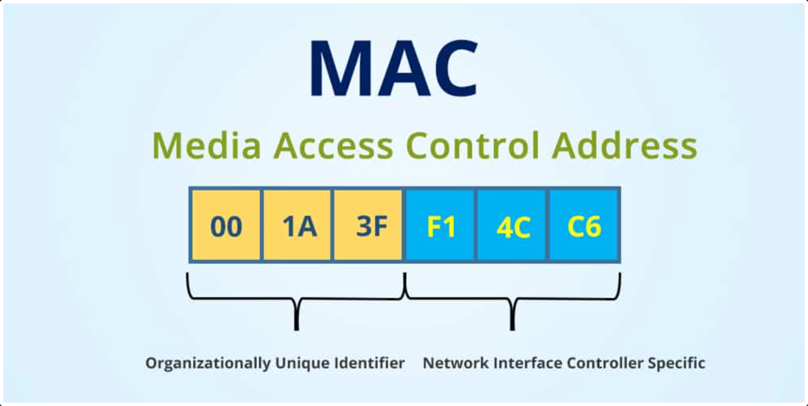
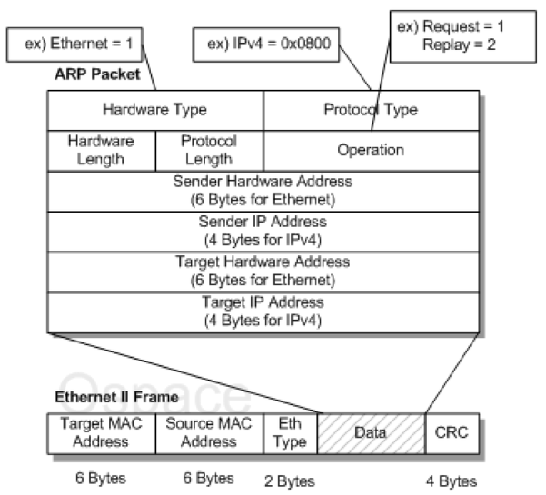
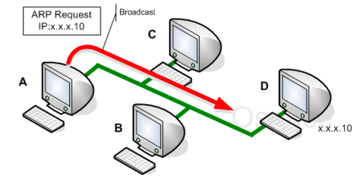
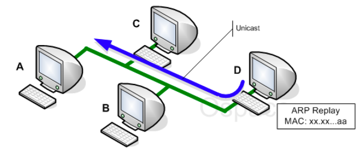
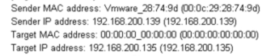
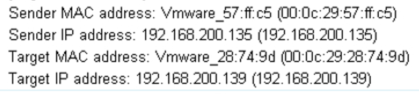

# ARP 란?

- 주소 결정 프로토콜(Address Resolution Protocol)

- 해당 IP를 그 IP주소에 맞는 물리적인 주소 즉, MAC주소를 가지고 오는 프로토콜

## MAC 주소

### MAC 주소란?

- 컴퓨터간 데이터를 주고받을 때 사용하는 물리적 장치의 주소

### MAC 주소의 구조

OUI - NIC 제조업체 고유 번호

NIC - 해당 업체가 생산해낸 LAN 카드 고유 번호

### MAC 주소와 IP 주소의 차이

MAC 주소: 하드웨어 주소

IP 주소: 네트워크 주소

IP 주소는 변동 가능성이 크지만 MAC 주소는 거의 고유하다!

## ARP 패킷 구조

- Sender Hardware Address

  - 송신자의 물리주소를 나타내는 필드

  - 이더넷의 경우 이필드는 6byte값

- Sender IP Address

  - 송신자의 논리주소를 나타내는 필드

  - IP프로토콜인 경우 4byte값

- Target Hardware Address

  - 목적지 시스템의 물리주소를 정의

  - 이더넷의 경우 6byte값

  - ARP Request인 경우 송신자는 목적지 시스템의 물리주소를 알 수 없어, 모두 0으로 설정

- Target IP Address

  - 목적지 시스템의 논리주소를 정의

  - IP 프로토콜의 경우 4byte값

## ARP 동작 원리

### ARP 요청

1) 송신자는 목적지 IP Address를 지정해 패킷 송신

2) IP 프로토콜이 ARP 프로토콜에게 ARP Request 메시지를 생성하도록 요청

   - ARP 요청 메시지 (송신자 물리주소, 송신자 IP주소, 00-00-00-00-00, 수신자 IP주소)

3) 메시지는 2계층으로 전달되고 이더넷 프레임으로 변경

   - 송신자 물리주소를 발신지 주소, 수신자 물리주소를 브로드캐스트 주소로 지정

4) 모든 호스트와 라우터는 프레임을 수신 후 자신의 ARP 프로토콜에게 전달

### ARP 응답

1. 목적지 IP Address가 일치하는 시스템은 자신의 물리주소를 포함하고 있는 ARP Reply 메시지를 보냄

   - 자신의 물리주소를 포함하는 응답 메시지

2. 최초 송신 측은 지정한 IP Address에 대응하는 물리주소를 획득

### 실제 ARP 패킷 분석

- request

- reply
- 

### 참고 자료

https://musclebear.tistory.com/12

https://jhnyang.tistory.com/404

https://ko.wikipedia.org/wiki/MAC_%EC%A3%BC%EC%86%8C

