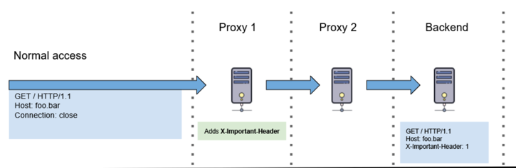
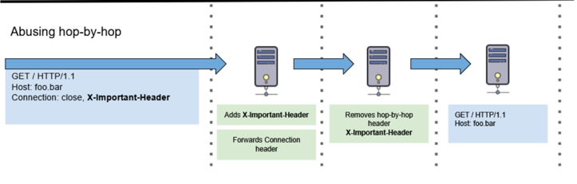

## 홉간 헤더(hop-by-hop)
- 단일 전송-레벨 연결에서만 의미가 있음
- 프록시에의해 재전송되거나 캐시 X
- Connection, Keep-Alive, Proxy-Authenticate, Proxy-Authorization, TE, Trailer, Transfer-Encoding, Upgrade 등

## 종단간 헤더(end-to-end)

- 최종 수신자에게 전달되어야 하는 헤더.
- request에 대해서는 서버, response에 대해서는 클라이언트
- 중간 프록시는 종단간 헤더를 수정되지 않은 상태로 재전송해야하며, 캐시는 이를 반드시 저장
- 위의 홉간 헤더의 종류를 제외한 모든 종류의 헤더가 종단간 헤더

### http hop-by-hop header abusing
- hop-by-hop 헤더 종류 중 하나인 Connection 헤더에서 일어날 수 있는 오류
- 끝까지 전달해야 할 헤더를 Connection 헤더에서 만들었을 때 발생



<br>
<br>



### http 예시
```http request
GET /api/users/profile HTTP/1.1
Host: vulnerable-website.com
Cookie: sessionid=...
Connection: close, Cookie
```
