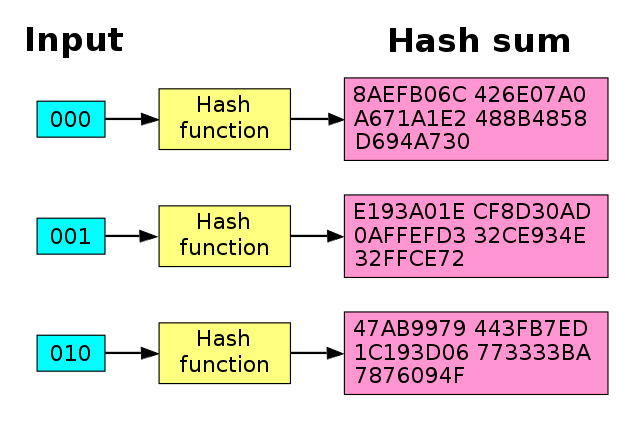
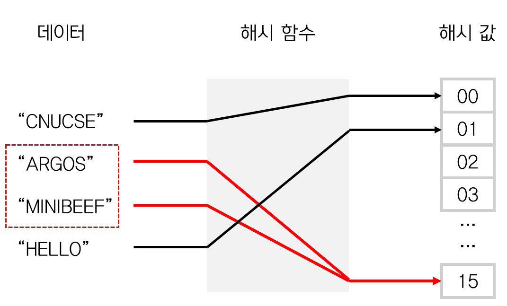

## 해시 알고리즘

### 해시 함수란?
- 임의의 길이를 갖는 임의의 데이터를 고정된 길이의 데이터로 매핑하는 단방향 함수
-> ???

- 길이가 어떻게 되든, 데이터가 무엇으로 이루어져 있든, 정해진 길이의 값이 나오는 함수!
-> 이러한 함수를 이용하여 암호화로 사용하는 방식을 해시 알고리즘!

### 해시 알고리즘의 특징
- 정해진 길이의 값이 나온다. 
  - 보통 128비트, 64비트
- 복호화가 일반적으로 불가능!
  - 단방향 매핑이기때문
  - ex)
    - a -> ENFP, ab -> FJSL 이를 `눈사태 효과` 
    

- 보통 비밀번호 등을 암호화할 때 사용

### 해시 알고리즘의 취약점
- 연산을 디게 많이 하면 몇 개 정도의 해시값의 복호화 값을 알 수도 있다.
- 해시 충돌

### 해시 알고리즘의 종류
- MD5 (Message Digest 5)
  - 전통적으로 가장 많이 사용되지만 그만큼 자료가 많아서 가장 취약함 ㅎ
  - DA897BA0FE30EFF270424AC0E768840F
- SHA(Secure Hash Algorithm)
  - 1993년부터 미국 NSA가 제작하고 미국 국립표준기술연구소(NIST)에서 표준으로 채택한 암호학적 해시 함수
  - SHA 0, 1은 취약점이 발견되어 2부터 사용함
  - 반환되는 해시 값의 비트에 따라 SHA-224, SHA-256, SHA-384, SHA-512 등으로 불림
  - 보통 SHA-256!
  - 2012년 10월 2일자로 Keccak이 SHA-3로 확정됐는데 잘 안쓰는듯
  - 사용처
    - 대한민국 인터넷뱅킹은 SHA-256을 사용
    - 비트코인은 작업 증명에 SHA-256을 사용
    - 이더리움은 Keccak256 을 사용
