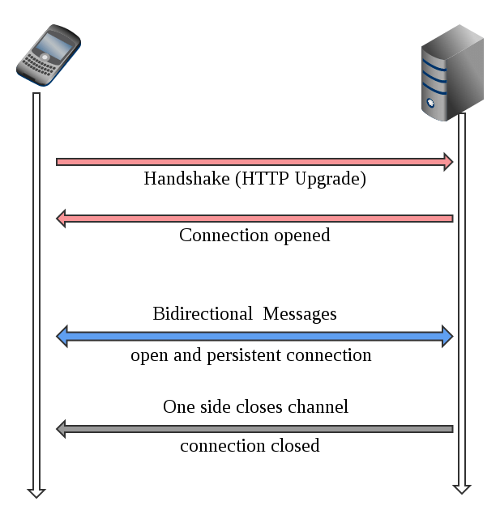

## HTTP의 한계

- HTTP 프로토콜은 요청에 대해서만 응답을 보낼 수 있기때문에 채팅에서 계속 메시지를 받기만 하는 상황을 구현하기 힘듦
- HTTP 프로토콜은 매 요청과 응답마다 연결을 수립하고 끊는 과정을 반복해야 했기 때문에, 유사한 통신을 계속 반복해야 한다는 비효율성에 대한 문제

## 웹소켓 특징

- 웹소켓은 실시간 양방향 통신을 지원 
- 한번 연결이 수립되면 클라이언트와 서버 모두 자유롭게 데이터를 보낼 수 있음
- ws, wss
- HTTP를 이용하여 연결을 수립 
- 연결 된 이후에도 통신을 할 때는 사용했던 포트인 80, 443을 이용 
- 핸드쉐이크가 끝나면 HTTP 프로토콜을 웹소켓 프로토콜로 변환하여 통신을 하는 구조

## 웹소켓 http 요청

```http request
GET /chat HTTP/1.1
Host: server.example.com
Upgrade: websocket
Connection: Upgrade
Sec-WebSocket-Key: x3JJHMbDL1EzLkh9GBhXDw==
Sec-WebSocket-Protocol: chat, superchat
Sec-WebSocket-Version: 13
Origin: http://example.com
```

- `Sec-WebSocket-Key`: 핸드쉐이크 응답을 검증할 키 값
- `Connection`: Upgrade
  - `keep-alive` 와 다른점은 연결을 keep alive 하면서 non-HTTP 요청으로 사용한다는 것
- `Upgrade`: 다른 프로토콜로 연결한다는 헤더(같은 전송 프로토콜 내에서)

```http request
HTTP/1.1 101 Switching Protocols
Upgrade: websocket
Connection: Upgrade
Sec-WebSocket-Accept: HSmrc0sMlYUkAGmm5OPpG2HaGWk=
Sec-WebSocket-Protocol: chat
```

- `Sec-WebSocket-Accept`: 정상적인 핸드쉐이크 과정을 검증
- 업그레이드가 되면 HTTP는 사용되지 않고, 웹 소켓 연결이 닫힐 때까지 두 끝 점에서 웹 소켓 프로토콜을 사용하여 데이터를 주고 받음
- 웹 소켓 연결은 주로 새로고침이나 창 닫기 등의 이벤트 발생 시 닫힘

## 연결 시각화


