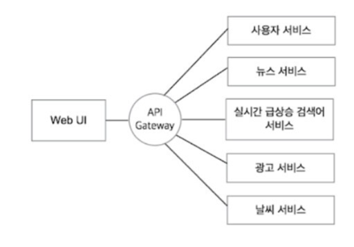

## 게이트웨이란?

- 게이트웨이 동작은 프록시와 매우 유사
- 게이트웨이의 경우는 게이트웨이가 클라이언트로부터 요청을 받은 뒤 통신하는 서버가 http 서버 이외의 서비스를 제공하는 서버
- 통신의 안전성을 높이는 역할

-> 교재 내용 끝! ㅂㅇ

 
 
 
 
 
 
 
 
 
 
 
 
 
 

## 게이트웨이 기본 개념

- 컴퓨터 네트워크에서 서로 다른 통신망, 프로토콜을 사용하는 네트워크 간의 통신을 가능하게 하는 컴퓨터나 소프트웨어를 두루 일컫는 용어
- 다른 네트워크로 들어가는 입구 역할을 하는 네트워크 포인트
- 서로 다른 프로토콜을 사용하는 둘 이상을 연결!

-> 다소 고전적인 개념이다!

## API Gateway

- 서비스로 전달되는 모든 API 요청의 관문 역할을 하는 서버 시스템의 아키텍처를 내부로 숨기고 외부의 요청에 대한 응답만을 적절한 형태로 응답
- 클라이언트는 내부 구조가 어떠한 아키텍쳐인지 알 필요 없이 서로 약속한 형태의 API 요청만을 서버에 보내고 응답 받음

### API Gateway 의 장점

- 클라이언트의 요청을 일괄적으로 처리
- 통합적으로 엔드포인트와 REST API 를 관리
- 전체 시스템의 부하를 분산 시키는 로드 밸런서의 역할
- 동일한 요청에 대한 불필요한 반복 작업을 줄일 수 있는 캐싱
- 시스템 상을 오고가는 요청과 응답에 대한 모니터링
- 시스템 내부의 아키텍처를 숨길 수 있음

### API Gateway 의 주요 기능

- 인증 및 인가
- 라우팅 및 로드밸런싱
- 요청 절차의 단순화

### 주요 사용처

- AWS API Gateway
- Spring Cloud Gateway